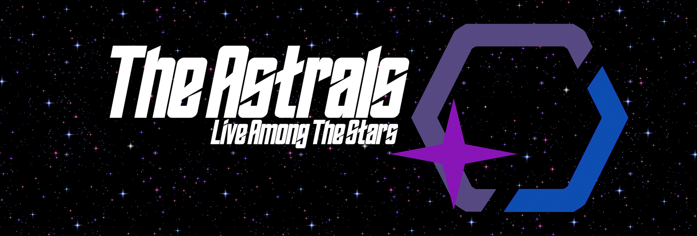

Continuation of the [Senither Hypixel Chat Bridge](https://github.com/Senither/hypixel-discord-chat-bridge)

A two-way chat bridge between [Hypixel](https://hypixel.net/) guild chat and a [Discord](https://discord.com/) channel.

The application utilizes [Discord.js-light](https://github.com/timotejroiko/discord.js-light) for communicating with Discord, and [Mineflayer](https://github.com/PrismarineJS/mineflayer) for communicating with Hypixel.

> This application will login to Hypixel using Mineflayer which is not a normal Minecraft client, this could result in your Minecraft account getting banned from Hypixel, so use this application at your own risk.

# Table of Content

- [Support]()
- [Installation/Usage Guide](#installationusage-guilde)
- [What's New](#whats-new)
- [Features](#features)
- [Commands](#commands)
  - [All Access](#all-access)
    - [Bot](#bot)
    - [Member](#member)
    - [Guild Info/Logs](#guild)
  - [Staff Only](#staff-only)
    - [Bot](#bot-1)
    - [Member](#member-1)
    - [Guild Info/Logs](#guild-1)
- [Roadmap](#roadmap)
- [License](#license)

## Support

Looking for help? Open an [issue](https://github.com/DuhItsJay/Guild-Chat-Bridge/issues) or get a hold of me in our [support server](https://discord.gg/astrals)!

## Installation/Usage Guide

See [INSTALLATION.md](./INSTALLATION.md) for instructions on how to install and use the Guild Bridge Chat from the source code

## What's New

This is a summary of what the latest version offers!

Previous Versions: [CHANGELOG.md](./CHANGELOG.md)

## Features

> Coming Soon

## Commands

`< >` = Required arguments, `[ ]` Optional arguments

### All Access

#### Bot

- `!help` - Displays the list of commands (`!h`)

#### Member

- `!member <user>` - Gets GEXP info for the specified user (`!mem`)

#### Guild

- `InfoCommand`
- `MemberListCommand`
- `OnlineCommand`
- `QuestCommand`
- `TopCommand`

### Staff Only

#### Bot

- `!override <command> [args]` - Executes the string attached. This is a dangerous permission to grant (`!o`, `!or`)
- `!relog [delay]` - Relogs the MC client, a delay can be given in seconds, if no delay is given it will default to 5 seconds (`!r`)

#### Member

- `!demote <user>` - Demotes the specified user by 1 rank (`!d`, `!down`)
- `!invite <player>` - Invites the specified user to the guild, providing the guild isn't full (`!i`, `!inv`)
- `!kick <user> [reason]` - Kicks the specified user from the guild (`!k`)
- `!mute [user] [time]` - Mutes the specified user or the whole guild for the given amount of time (`!m`)
- `!promote <user>` - Promotes the specified user by 1 rank (`!p`, `!up`)
- `!setrank <user> <rank>` - Promotes/Demotes the specified user to the given rank (`!sr`, `!rank`)
- `!unmute [user]` - Unmutes the specified user or the whole guild (`!un`, `!um`)

#### Guild

- `!discord [discord link | reset]` - View or Set or reset the discord link for the guild
- `HistoryCommand`
- `LogCommand`
- `NotificationCommand`
- `OnlinemodeCommand`
- `SlowmodeCommand`
- `TagCommand`
- `TagcolorCommand`

## Roadmap

- [ ] Guild Commands:

  - /guild menu - Opens the Guild Menu

    - GUI Clicking
    - Still in consideration (possibly bannable)

  - /guild motd - Modifies the MOTD for the Guild

    - add `<text>` - Adds a line in the MOTD
    - clear - Clears the MOTD
    - help - Prints this help message
    - list - List lines in the MOTD
    - preview - Preview what the MOTD will look like to players
    - set `<line>` `<text>` - Sets a line in the MOTD

  - /guild settings `<setting>` `<value>` - Modify settings for your guil
    - SHOWN
    - DESCRIPTION
    - GAMES

- [ ] Chat message filter
  - The filter should block any messages sent from Discord to Hypixel that contains bannable words, and words that could potentially cause a mute.
- [ ] Ingame commands
  - Add commands for players to use ingame to check other player stats (eg `!skills <ign>`, `!weight <ign>` etc)

## License

Hypixel Discord Chat Bridge is open-sourced software licensed under the [MIT License](https://opensource.org/licenses/MIT).
